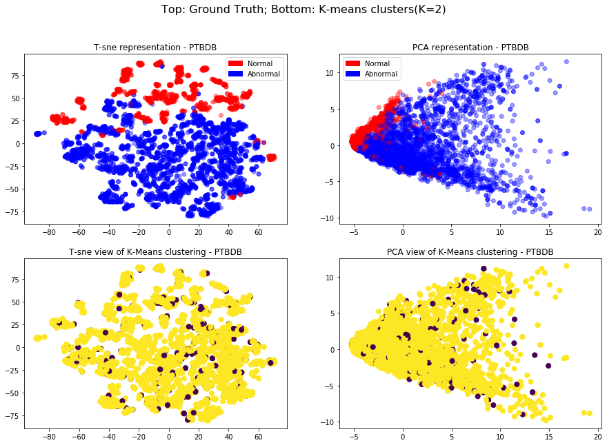
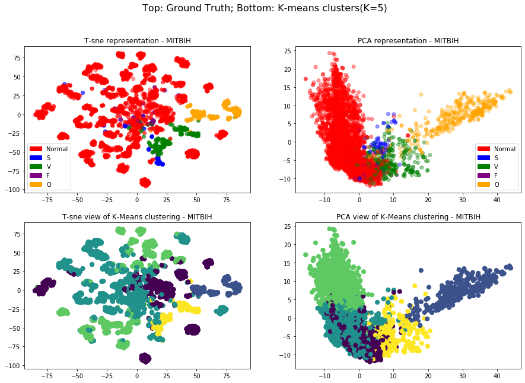
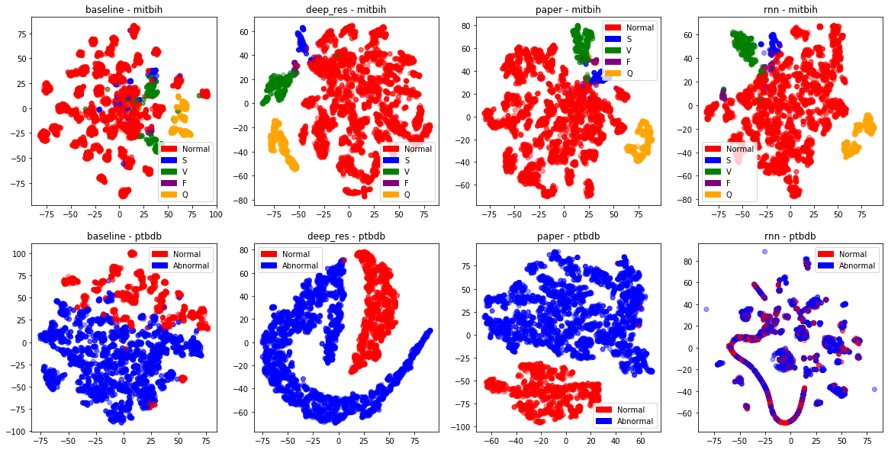

# ECG Classification

This repository is the result of a work on ECG Classification, with a large focus on visualization and representation learning, carried out by me and [Andrej Ivanov](https://github.com/AndrejIvanov1).

We used 2 databases, [MIT-BIH and PTBDB](https://www.kaggle.com/shayanfazeli/heartbeat). The first contains much over 100,000 samples and 5 different classes while the latter contains just under 15,000 samples divided into 2 classes. Both are ECG readings that have been pre-processed.

This repositiory contains the following approaches, which are easily accessible through the [Index Notebook](Index.ipynb):

1. Baseline CNN
2. Residual CNN
3. Deep residual CNN
4. RNN
5. Bidirectional RNN
6. Transfer Learning from the larger dataset to the smaller one
7. Ensemble method

Here are the initial results from our visualizations. These are pca and t-sne projections of the representations achieved by the baseline CNN.

PTBDB dataset

MITBIH dataset

And here are comparisons from the representations achieved by each deep model:

